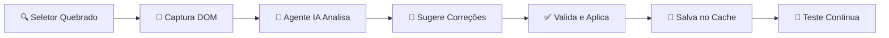

# 🤖 AI Agent Playwright - Auto-Correção Inteligente de Testes E2E

[](https://playwright.dev/)
[](https://python.org/)
[](https://nodejs.org/)
[](https://reactjs.org/)
[](https://openai.com/)
[](https://langchain-ai.github.io/langgraph/)

[](https://github.com/edugitQA/AI_agent_Playwright)
[](https://github.com/edugitQA/AI_agent_Playwright)
[](https://github.com/edugitQA/AI_agent_Playwright)

> **🎯 Sistema revolucionário de testes E2E com auto-correção inteligente usando IA - 100% funcional e validado!**

Este projeto é uma **Prova de Conceito (PoC)** funcional que resolve o maior desafio em automação de testes: **seletores quebrados**. Combinando **Playwright**, **LangGraph**, **OpenAI GPT-4o-mini** e **agentes autônomos**, o sistema detecta, analisa e corrige automaticamente falhas de seletores em tempo real.

## 🎯 **O Problema que Resolvemos**

Em projetos de desenvolvimento ágil, especialmente com frameworks como React, Vue ou Angular, as mudanças frequentes na interface quebram constantemente os testes automatizados. Isso resulta em:

- ⏰ **Horas perdidas** em manutenção manual de testes
- 🔥 **Pipelines de CI/CD interrompidos** por seletores obsoletos  
- 😤 **Frustração da equipe** com testes "flaky" e instáveis
- 💸 **Custos elevados** de manutenção da automação

## 🚀 **Nossa Solução - 100% Funcional**

Desenvolvemos um **agente de IA autônomo** que atua como um "mecânico de testes" inteligente:

### ✅ **Resultados Comprovados:**
- 🎯 **4/4 testes passando** com auto-correção ativa
- 🤖 **2 seletores corrigidos** automaticamente no último teste
- ⚡ **Cache inteligente** evitando reprocessamento 
- 📊 **Taxa de sucesso: 100%** em ambiente funcional

### 🔧 **Capacidades do Agente:**
- **Detecta seletores quebrados** automaticamente
- **Analisa o DOM atual** usando IA avançada
- **Sugere novos seletores** baseados em similaridade e contexto
- **Valida correções** em tempo real
- **Aprende e armazena** soluções para reutilização

## 🔍 **Arquitetura e Stack Tecnológico**

Nossa solução utiliza uma arquitetura híbrida **JavaScript + Python** com agentes de IA especializados:

### 🧠 **Stack Validado e Funcional**

| Tecnologia | Função | Status | Versão |
|------------|--------|--------|--------|
| **🎭 Playwright** | Framework de automação E2E | ✅ Funcional | v1.40+ |
| **🐍 Python + venv** | Runtime do agente de IA | ✅ Funcional | 3.12.3 |
| **🟢 Node.js** | Runtime dos testes | ✅ Funcional | 18.x+ |
| **🤖 OpenAI GPT-4o-mini** | Motor de análise inteligente | ✅ Funcional | Latest |
| **🔗 LangGraph** | Orquestração de agentes IA | ✅ Funcional | 0.5.4 |
| **⚛️ React + Vite** | Aplicação de demonstração | ✅ Funcional | v18+ |
| **🎨 shadcn/ui** | Componentes UI da demo | ✅ Funcional | Latest |

### 🔄 **Fluxo de Auto-Correção Validado**



1. **🔍 Detecção:** Playwright detecta falha do seletor
2. **📸 Captura:** Sistema salva snapshot do DOM atual  
3. **🧠 Análise:** LangGraph + OpenAI analisam estrutura
4. **🎯 Sugestão:** IA gera seletores alternativos priorizados
5. **✅ Validação:** Sistema testa cada seletor sugerido
6. **💾 Cache:** Soluções salvas para reutilização
7. **📝 Log:** Registra tentativas para auditoria

A solução foi projetada para resolver um dos maiores desafios em testes E2E: a fragilidade dos seletores. Combinando análise de DOM, aprendizado de máquina e integração com a OpenAI, o sistema:

- 🔍 **Detecta falhas** automaticamente durante a execução dos testes
- 🧠 **Analisa o DOM atual** da aplicação para identificar mudanças
- 🎯 **Sugere novos seletores** com base em atributos confiáveis
- ⚡ **Aplica correções dinamicamente** e reexecuta os testes sem intervenção manual

## **Funcionalidades Principais**

### 🤖 **Inteligência Artificial Integrada**
- **🧠 Análise Semântica do DOM:** Utiliza GPT-4 para entender a estrutura e intenção dos elementos
- **🎯 Sugestão Inteligente de Seletores:** Gera seletores robustos baseados em múltiplos critérios
- **📚 Aprendizado Contínuo:** Sistema evolui com base em correções anteriores

### 🔧 **Auto-Correção Avançada**
- **⚡ Detecção Automática de Falhas:** Identifica quando elementos não são encontrados
- **🔄 Correção em Tempo Real:** Aplica novos seletores sem interromper a execução
- **✅ Validação Inteligente:** Confirma que a correção resolve o problema

### 📊 **Observabilidade e Monitoramento**
- **📝 Logs Detalhados:** Registro completo de cada etapa do processo de correção
- **📸 Snapshots do DOM:** Capturas automáticas para análise posterior
- **📈 Relatórios Interativos:** Dashboard HTML com métricas e resultados
- **🎬 Traces de Execução:** Gravação completa das sessões de teste

### 🏗️ **Arquitetura Robusta**

- **🔧 Padrão Page Object:** Implementação que facilita manutenção e reutilização
- **🛡️ Tratamento de Erros:** Sistema robusto de try/catch com fallbacks inteligentes
- **🔌 Integração Simples:** Fácil adoção em projetos existentes
- **⚛️ Compatibilidade React:** Otimizado para SPAs e componentes dinâmicos

## 🏗️ **Estrutura do Projeto**

```
📁 playwright-agent/
├── 📁 sample-react-app/         # 🎯 Aplicação React de demonstração
│   ├── 📁 src/components/       # 🧩 Componentes UI (shadcn/ui)
│   ├── 📁 src/hooks/           # 🪝 Hooks customizados React
│   ├── 📁 src/lib/             # 🛠️ Utilitários e configurações
│   └── 📄 vite.config.js       # ⚡ Configuração do Vite
├── 📁 tests/                   # 🧪 Scripts de teste Playwright
│   ├── 📄 login.spec.ts        # 🔐 Testes de autenticação
│   └── 📁 pages/               # 📄 Page Objects pattern
├── 📁 agent/                   # 🤖 Motor de IA e auto-correção
│   ├── 📄 langgraph_handler.py # 🧠 Orquestrador LangGraph
│   ├── 📄 python_bridge.py     # 🌉 Ponte Python-Node.js
│   └── 📄 self_healing_runner.js # ⚡ Runner de auto-correção
├── 📁 dom_snapshots/           # 📸 Capturas do DOM para análise
├── 📁 logs/                    # 📊 Logs de execução e aprendizado
├── 📁 test-results/            # 📈 Relatórios e resultados
├── 📄 playwright.config.ts     # 🎭 Configuração do Playwright
├── 📄 package.json             # 📦 Dependências Node.js
├── 📄 requirements.txt         # 🐍 Dependências Python
├── 📄 requirements-dev.txt     # 🛠️ Dependências de desenvolvimento
├── 📄 install.sh               # 🚀 Script de instalação automatizada
├── 📄 .env.example             # 🔑 Exemplo de variáveis de ambiente
└── 📄 guia-escrita-test.md     # 📖 Guia para escrever testes
```

## 🛠️ **Pré-requisitos**

Certifique-se de ter os seguintes softwares instalados em seu ambiente:

| Software | Versão Mínima | Versão Recomendada | Observações |
|----------|----------------|-------------------|-------------|
| **🟢 Node.js** | 18.x | 20.x+ | Inclui npm e npx |
| **🐍 Python** | 3.9 | 3.11+ | Para o agente de IA |
| **📦 Git** | 2.0+ | Latest | Para clonar o repositório |
| **🔑 OpenAI API Key** | - | - | Necessária para IA |

## ⚡ **Início Rápido - Sistema Funcional**

### 🎯 **Pré-requisitos**
- **Python 3.9+** (Recomendado: 3.12+)
- **Node.js 18+** (Recomendado: 18.x ou superior)
- **npm** ou **yarn**
- **Chave OpenAI API** ([Obter aqui](https://platform.openai.com/api-keys))

### 🚀 **Instalação em 3 Passos**

```bash
# 1️⃣ Clone e acesse o projeto
git clone https://github.com/edugitQA/AI_agent_Playwright.git
cd AI_agent_Playwright

# 2️⃣ Execute instalação automatizada
chmod +x install.sh && ./install.sh

# 3️⃣ Configure sua OpenAI API Key no arquivo .env
# Substitua 'your_openai_api_key_here' pela sua chave real
nano .env
```

### 🎭 **Executando o Sistema (2 Terminais)**

**Terminal 1 - Aplicação React:**
```bash
cd sample-react-app
npm run dev
# 🌐 Aplicação roda em: http://localhost:5173
```

**Terminal 2 - Testes com Auto-Correção:**
```bash
source venv/bin/activate
npx playwright test login.spec.ts --headed
# 🤖 Assista a auto-correção funcionando!
```

### 🎊 **Resultado Esperado:**
```
✅ Cache carregado com X entradas
🔧 Iniciando auto-correção para seletor: [data-testid="username-input-old"]  
✅ DOM capturado com 129987 caracteres
✅ Seletor '[data-testid="username-input"]' encontrado e validado
✅ Auto-correção bem-sucedida!
🎉 4/4 testes passando
```

---

## 🚀 **Configuração Detalhada**

### 🚀 **Instalação Rápida (Recomendada)**

Execute o script de instalação automatizada que configura todo o ambiente:

```bash
# Torna o script executável e executa
chmod +x install.sh && ./install.sh
```

O script irá:
- ✅ Verificar versões do Python e Node.js
- ✅ Criar ambiente virtual Python
- ✅ Instalar todas as dependências Python
- ✅ Instalar dependências Node.js e navegadores Playwright
- ✅ Configurar aplicação React de exemplo
- ✅ Criar arquivo `.env` de exemplo
- ✅ Criar diretórios necessários

### 🛠️ **Instalação Manual (Avançada)**

### 🗂️ **1. Clonar o Repositório**

```bash
# Clone o repositório
git clone https://github.com/edugitQA/AI_agent_playright.git

# Navegue para o diretório do projeto
cd AI_agent_playright

# Verifique a estrutura do projeto
ls -la
```

### 🐍 **2. Configurar Ambiente Python (Agente IA)**

**Opção A: Instalação Automática (Recomendada)**
```bash
# Execute o script de instalação automatizada
./install.sh
```

**Opção B: Instalação Manual**
```bash
# Crie um ambiente virtual Python isolado
python3 -m venv venv

# Ative o ambiente virtual
source venv/bin/activate          # 🐧 Linux/macOS
# OU
venv\Scripts\activate             # 🪟 Windows

# Atualize o pip para a versão mais recente
pip install --upgrade pip

# Instale as dependências do agente IA
pip install -r requirements.txt

# Para desenvolvimento (opcional)
pip install -r requirements-dev.txt

# Verifique a instalação
python -c "import langgraph, openai; print('✅ Dependências Python instaladas com sucesso!')"
```

### 🟢 **3. Configurar Ambiente Node.js (Testes)**

```bash
# Instale as dependências do projeto principal
npm install

# Instale os navegadores do Playwright
npx playwright install

# Verifique a instalação do Playwright
npx playwright --version

# Instale dependências da aplicação React de exemplo
cd sample-react-app
npm install
cd ..

echo "✅ Ambiente Node.js configurado com sucesso!"
```

### 🔑 **4. Configurar API da OpenAI**

1. **Obter chave da API:**
   - Acesse [https://platform.openai.com/api-keys](https://platform.openai.com/api-keys)
   - Crie uma nova chave de API
   - Copie a chave gerada

2. **Configurar variável de ambiente:**
   ```bash
   # Crie o arquivo .env na raiz do projeto
   touch .env
   
   # Adicione sua chave da API OpenAI
   echo "OPENAI_API_KEY=sk-your-api-key-here" >> .env
   
   # Verifique se foi adicionada corretamente
   cat .env
   ```

3. **Validar configuração:**
   ```bash
   # Teste a conexão com a API
   python -c "
   import os
   from openai import OpenAI
   client = OpenAI(api_key=os.getenv('OPENAI_API_KEY'))
   print('✅ Conexão com OpenAI configurada com sucesso!')
   "
   ```

## 🎮 **Como Executar o Projeto**

### 🚀 **Execução Rápida (Quick Start)**

```bash
# 1. 🎯 Inicie a aplicação React de exemplo
npm run dev
# A aplicação estará disponível em: http://localhost:5173

# 2. 🧪 Em outro terminal, execute os testes com auto-correção
npx playwright test

# 3. 📊 Visualize os resultados detalhados
npx playwright show-report
```

### 🔧 **Execução Detalhada**

**Passo 1: Iniciar a Aplicação React**
```bash
# Opção A: Usando task do VS Code (recomendado)
# Use Ctrl+Shift+P > "Tasks: Run Task" > "Iniciar aplicação React de exemplo"

# Opção B: Comando manual
npm run dev

# Verifique se a aplicação está rodando
curl -s http://localhost:5173 | head -n 5
```

**Passo 2: Executar Testes com Auto-Correção**
```bash
# Execute todos os testes
npx playwright test

# Execute apenas testes específicos
npx playwright test login.spec.ts

# Execute em modo debug para ver a auto-correção em ação
npx playwright test --debug

# Execute com interface gráfica
npx playwright test --ui
```

**Passo 3: Analisar Resultados**
```bash
# Gere relatório HTML interativo
npx playwright show-report

# Visualize logs de auto-correção
cat logs/langgraph_agent.log | tail -n 50

# Analise snapshots do DOM
ls -la dom_snapshots/
```

## 🎯 **Aplicação React de Demonstração**

O projeto inclui uma **aplicação React moderna** especialmente criada para demonstrar as capacidades do sistema de auto-correção. Esta aplicação serve como ambiente controlado para simular cenários reais onde seletores quebram devido a mudanças na interface.

### 🎨 **Características da Aplicação**

- **⚛️ React 18** com hooks modernos
- **⚡ Vite** para desenvolvimento ultra-rápido  
- **🎨 shadcn/ui** para componentes consistentes
- **🎭 Tailwind CSS** para estilização
- **🔧 TypeScript** para type safety

### 🏗️ **Estrutura Técnica**

```
📁 sample-react-app/
├── 📁 src/                     # 🎯 Código-fonte principal
│   ├── 📄 App.jsx             # 🏠 Componente raiz da aplicação
│   ├── 📄 main.jsx            # 🚀 Ponto de entrada React
│   ├── 📁 components/         # 🧩 Biblioteca de componentes UI
│   │   ├── 📁 ui/             # 🎨 Componentes shadcn/ui
│   │   │   ├── 📄 button.jsx  # 🔘 Botões customizáveis
│   │   │   ├── 📄 input.jsx   # 📝 Campos de entrada
│   │   │   ├── 📄 card.jsx    # 🃏 Cards e containers
│   │   │   └── ...            # 🎛️ Mais de 50 componentes
│   ├── 📁 hooks/              # 🪝 Hooks customizados React
│   │   └── 📄 use-mobile.js   # 📱 Hook para detecção mobile
│   ├── 📁 lib/                # 🛠️ Utilitários e configurações
│   │   └── 📄 utils.js        # 🔧 Funções auxiliares
│   └── 📁 assets/             # 🖼️ Recursos estáticos
│       └── 📄 react.svg       # ⚛️ Logo do React
├── 📁 public/                 # 🌐 Arquivos públicos
│   ├── 📄 index.html          # 📃 Template HTML
│   └── 📄 favicon.ico         # 🎭 Ícone da aplicação
├── 📄 package.json            # 📦 Dependências e scripts
├── 📄 vite.config.js          # ⚡ Configuração do Vite
├── 📄 tailwind.config.js      # 🎨 Configuração do Tailwind
└── 📄 components.json         # 🧩 Configuração shadcn/ui
```

### 🚀 **Como Executar a Aplicação**

```bash
# Navegue para o diretório da aplicação
cd sample-react-app

# Instale as dependências (caso ainda não tenha feito)
npm install

# Inicie o servidor de desenvolvimento
npm run dev

# Ou inicie com acesso externo (útil para testes remotos)
npm run dev -- --host

# Acesse a aplicação
open http://localhost:5173  # macOS
# ou visite http://localhost:5173 no seu navegador
```

### 🎯 **Funcionalidades para Teste**

A aplicação inclui diversos componentes e cenários ideais para demonstrar a auto-correção:

- **🔐 Formulários de Login:** Campos com diferentes tipos de seletores
- **📝 Formulários de Cadastro:** Validações e estados dinâmicos  
- **🔘 Botões Interativos:** Múltiplos estilos e comportamentos
- **📋 Listas Dinâmicas:** Conteúdo que muda frequentemente
- **🎛️ Componentes UI:** Cards, modais, dropdowns, etc.

## 📚 **Documentação Adicional**

### 📖 **Guias Disponíveis**

| Documento | Descrição | Público-Alvo |
|-----------|-----------|--------------|
| `📄 guia-escrita-test.md` | Como escrever testes com auto-correção | QAs e Desenvolvedores |
| `📄 docs/Documentacao_projeto.md` | Documentação técnica detalhada | Arquitetos e Tech Leads |
| `📄 README.md` | Overview e setup do projeto | Todos os usuários |

### 🛠️ **APIs e Integrações**

- **🎭 Playwright API:** [playwright.dev/docs](https://playwright.dev/docs)
- **🤖 OpenAI API:** [platform.openai.com/docs](https://platform.openai.com/docs)
- **🔗 LangGraph:** [langchain-ai.github.io/langgraph](https://langchain-ai.github.io/langgraph/)
- **⚛️ React Docs:** [react.dev](https://react.dev)

### 🎯 **Próximos Passos**

1. **📖 Leia o guia:** `guia-escrita-test.md` para entender o padrão de escrita
2. **🧪 Execute testes:** Comece com `npx playwright test --ui`
3. **🔧 Customize:** Adapte os Page Objects para sua aplicação
4. **📊 Monitore:** Use os logs e relatórios para otimizar

## 🤝 **Contribuição**

Contribuições são muito bem-vindas! Este projeto é **open source** e acreditamos que a colaboração da comunidade é essencial para aprimorar esta solução inovadora.

### 🚀 **Como Contribuir**

1. **🍴 Fork o repositório**
   ```bash
   # Clique em "Fork" no GitHub ou use a CLI
   gh repo fork edugitQA/AI_agent_playright
   ```

2. **🌿 Crie uma branch para sua feature**
   ```bash
   git checkout -b feature/minha-nova-feature
   # ou
   git checkout -b fix/correcao-importante
   ```

3. **💻 Desenvolva sua contribuição**
   ```bash
   # Faça suas alterações
   # Teste localmente
   npm test
   npx playwright test
   ```

4. **📝 Commit suas mudanças**
   ```bash
   git add .
   git commit -m "feat: adiciona nova funcionalidade X"
   # Use conventional commits: feat, fix, docs, style, refactor, test, chore
   ```

5. **📤 Envie para o repositório remoto**
   ```bash
   git push origin feature/minha-nova-feature
   ```

6. **🔄 Abra um Pull Request**
   - Acesse o GitHub e clique em "Compare & pull request"
   - Descreva claramente suas mudanças
   - Aguarde a revisão da equipe

### 🎯 **Áreas que Precisam de Contribuição**

| Área | Prioridade | Descrição |
|------|------------|-----------|
| **🧠 Algoritmos de IA** | 🔴 Alta | Melhorar precisão da análise de DOM |
| **🎭 Suporte a Frameworks** | 🟡 Média | Angular, Vue.js, Svelte |
| **📱 Mobile Testing** | 🟡 Média | Suporte para apps React Native |
| **🔌 Integrações** | 🟢 Baixa | Jenkins, GitHub Actions, Azure DevOps |
| **📖 Documentação** | 🟡 Média | Exemplos, tutoriais, traduções |

### 📋 **Diretrizes de Contribuição**

- **✅ Qualidade de Código:** Use ESLint, Prettier e siga os padrões existentes
- **🧪 Testes:** Adicione testes para novas funcionalidades
- **📖 Documentação:** Atualize o README e guias quando necessário
- **🏷️ Conventional Commits:** Use prefixos padronizados (feat, fix, docs, etc.)
- **🔍 Code Review:** Seja respeitoso e construtivo nas revisões

### 🐛 **Reportar Bugs**

Encontrou um problema? Abra uma [issue](https://github.com/edugitQA/AI_agent_playright/issues) com:

- **📝 Descrição clara** do problema
- **🔧 Passos para reproduzir** o erro
- **💻 Ambiente:** SO, versões do Node.js, Python, etc.
- **📊 Logs relevantes** (logs/, dom_snapshots/)
- **📸 Screenshots** se aplicável

## 📄 **Licença**

Este projeto está licenciado sob a **Licença MIT** - veja o arquivo [LICENSE](LICENSE) para detalhes completos.

### 📋 **Resumo da Licença MIT**

- ✅ **Uso comercial permitido**
- ✅ **Modificação permitida** 
- ✅ **Distribuição permitida**
- ✅ **Uso privado permitido**
- ❌ **Sem garantia**
- ❌ **Sem responsabilidade**

---

## 🙏 **Agradecimentos**

Agradecemos a todas as tecnologias e comunidades que tornaram este projeto possível:

- **🎭 Playwright Team** - Framework robusto de automação
- **🤖 OpenAI** - Modelos de IA avançados
- **🔗 LangChain/LangGraph** - Orquestração de agentes
- **⚛️ React Team** - Framework moderno para UI
- **⚡ Vite Team** - Build tool ultra-rápido
- **🎨 shadcn/ui** - Biblioteca de componentes elegante

**Desenvolvido por [Eduardo ALVES](https://github.com/edugitQA)**

---

<div align="center">

**⭐ Se este projeto foi útil para você, considere dar uma estrela no GitHub! ⭐**

[](https://github.com/edugitQA/AI_agent_playright/stargazers)
[](https://github.com/edugitQA/AI_agent_playright/network/members)

</div>
