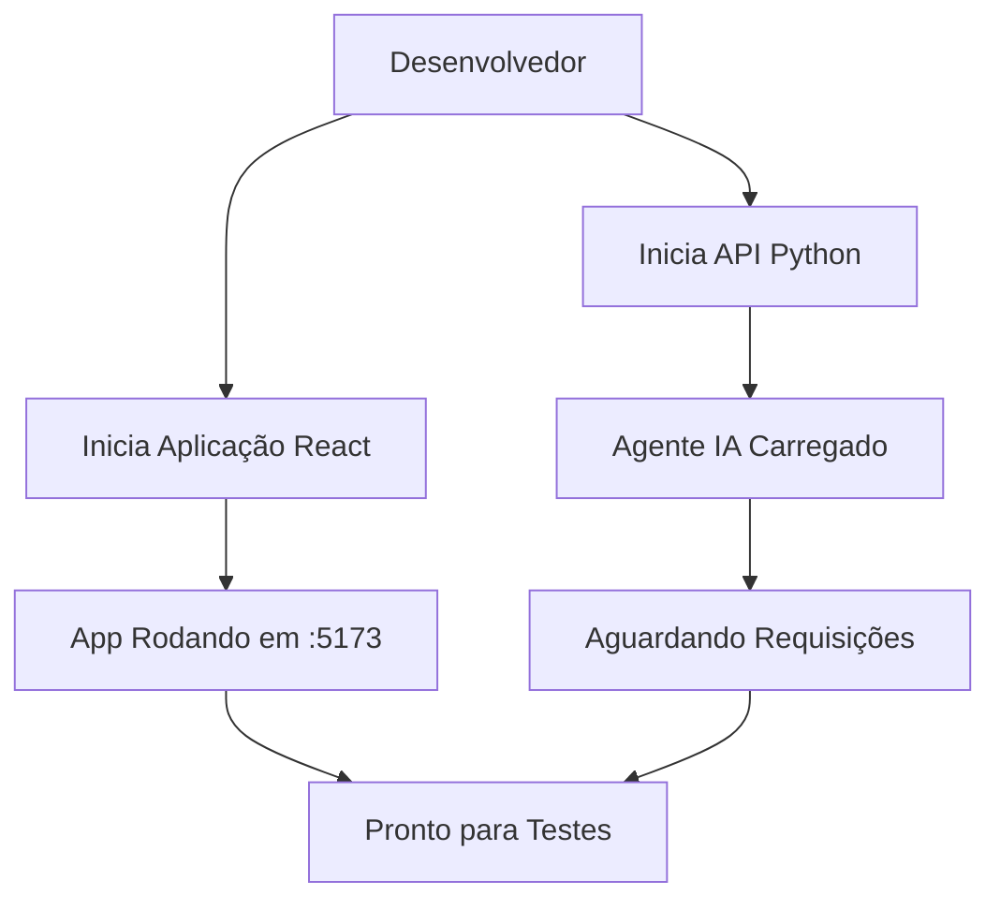
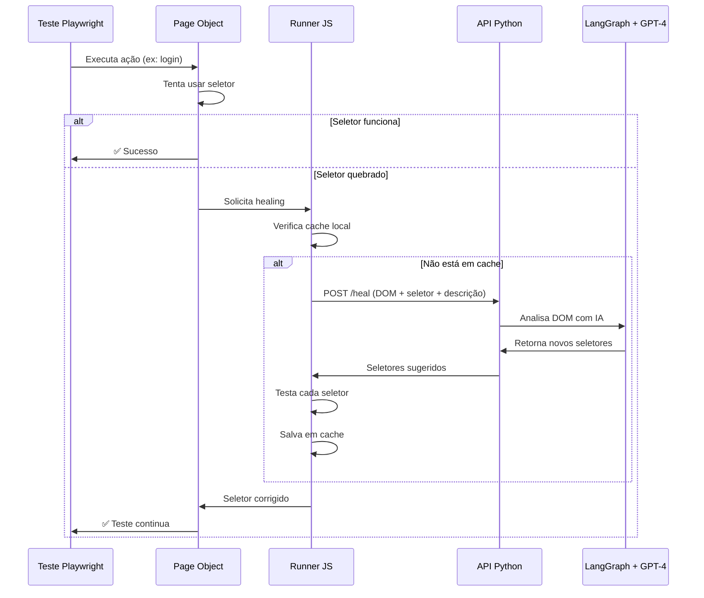

# 🏢 Arquitetura Empresarial - Sistema de Testes Auto-Curativos com IA

## 📋 Visão Geral

Este documento descreve a arquitetura robusta e escalável implementada para ambientes empresariais reais, onde testes E2E são mantidos junto ao código da aplicação, seguindo as melhores práticas da indústria.

## 🎯 Objetivos da Reestruturação

- ✅ **Separação de Responsabilidades**: Testes vivem dentro do projeto da aplicação
- ✅ **Independência de Dependências**: Cada projeto gerencia suas próprias libs
- ✅ **Escalabilidade**: Fácil replicação para múltiplos projetos
- ✅ **CI/CD Ready**: Configuração pronta para pipelines empresariais
- ✅ **Manutenibilidade**: Estrutura clara e documentada

---

## 🏗️ Arquitetura do Sistema

### Estrutura de Diretórios

```
AI_agent_Playwright/
│
├── agent/                          # 🤖 Serviço de IA Centralizado
│   ├── api.py                      # API FastAPI do agente
│   ├── langgraph_handler.py        # Orquestração LangGraph + OpenAI
│   ├── self_healing_runner.js     # Runner JavaScript com auto-correção
│   ├── requirements.txt            # Dependências Python
│   └── .venv/                      # Ambiente virtual Python
│
├── sample-react-app/               # 📱 Aplicação React + Testes
│   ├── src/                        # Código da aplicação
│   │   ├── components/             # Componentes React
│   │   └── App.jsx                 # App principal
│   │
│   ├── tests/                      # 🧪 Testes E2E (Playwright)
│   │   ├── login.spec.ts           # Specs de teste
│   │   └── pages/                  # Page Objects
│   │       └── LoginPage.ts        # POM com auto-healing
│   │
│   ├── playwright.config.ts        # Config Playwright
│   ├── tsconfig.json               # Config TypeScript
│   ├── package.json                # Deps Node.js + Scripts
│   └── test-results/               # Relatórios e artefatos
│
├── .env                            # 🔐 Variáveis de ambiente (gitignored)
├── .selector-cache.json            # Cache de seletores corrigidos
└── docs/                           # 📚 Documentação
    └── arquitetura-empresarial.md  # Este documento
```

---

## 🔄 Fluxo de Execução

### 1. Inicialização do Sistema



### 2. Execução de Teste com Auto-Healing



---

## 🛠️ Componentes Principais

### 1. **API Python (agent/api.py)**

**Responsabilidades:**
- Expõe endpoint REST para healing de seletores
- Orquestra comunicação com LangGraph
- Gerencia sessão do modelo de IA
- Mantém contexto entre requisições

**Endpoints:**

```python
GET  /health          # Verificação de saúde
POST /heal            # Solicita correção de seletor
```

**Request Body (/heal):**
```json
{
  "dom_html": "<html>...</html>",
  "original_selector": "[data-testid='old-selector']",
  "element_description": "Botão de login principal",
  "error_message": "Timeout esperando elemento"
}
```

**Response:**
```json
{
  "analysis": "Seletor antigo não existe. Encontrei novo botão.",
  "suggested_selectors": [
    "[data-testid='login-button']",
    "button:has-text('Entrar')",
    "#login-form button[type='submit']"
  ],
  "confidence": 0.95
}
```

### 2. **LangGraph Handler (agent/langgraph_handler.py)**

**Funcionalidades:**
- Parse inteligente de DOM com BeautifulSoup
- Análise semântica de elementos
- Geração de múltiplas estratégias de seleção
- Integração com OpenAI GPT-4o-mini

**Estratégias de Seleção:**
1. **data-testid** (prioridade máxima)
2. **IDs únicos**
3. **Classes específicas**
4. **XPath contextual**
5. **Texto visível**
6. **Hierarquia DOM**

### 3. **Self-Healing Runner (agent/self_healing_runner.js)**

**Características:**
- Sistema de cache persistente (`.selector-cache.json`)
- Testes automáticos de seletores sugeridos
- Retry logic inteligente
- Logging detalhado para debugging

**Métodos Principais:**
```javascript
healBrokenSelector(originalSelector, description, maxAttempts)
_loadCache()          // Carrega cache de seletores
_saveCache()          // Persiste correções
_captureCurrentDOM()  // Snapshot do DOM
_testSelector()       // Valida seletor no DOM real
```

### 4. **Page Objects com Auto-Healing**

**Padrão Implementado:**
```typescript
async fillUsername(username: string) {
    try {
        // Tenta usar seletor padrão
        await this.page.locator(this.selectors.usernameInput).fill(username);
    } catch (error) {
        // Aciona auto-correção
        const healedSelector = await this.runner.healBrokenSelector(
            'usernameInput',
            this.selectors.usernameInput,
            'Campo de entrada de usuário/email com label "Usuário"'
        );
        
        if (healedSelector) {
            this.updateSelector('usernameInput', healedSelector);
            await this.page.locator(this.selectors.usernameInput).fill(username);
        } else {
            throw new Error('Auto-correção falhou');
        }
    }
}
```

---

## 🚀 Guia de Uso

### Configuração Inicial

#### 1. Configurar Ambiente Python

```powershell
# Criar ambiente virtual
cd agent
python -m venv .venv

# Ativar (Windows PowerShell)
.\.venv\Scripts\Activate.ps1

# Instalar dependências
pip install -r requirements.txt
```

#### 2. Configurar Variáveis de Ambiente

Criar `.env` na raiz do projeto:

```bash
# OpenAI API Configuration
OPENAI_API_KEY=sk-proj-your-key-here
OPENAI_MODEL=gpt-4o-mini

# Playwright Configuration
PLAYWRIGHT_TIMEOUT=30000
PLAYWRIGHT_HEADLESS=false
NAVIGATION_TIMEOUT=45000

# Agent Configuration
AGENT_MAX_RETRIES=3
AGENT_API_URL=http://localhost:8000
CACHE_ENABLED=true
DEBUG_MODE=false
```

#### 3. Instalar Dependências do Projeto de Testes

```powershell
cd sample-react-app
npm install --legacy-peer-deps
npx playwright install chromium
```

### Execução em Desenvolvimento

#### Terminal 1: API do Agente de IA

```powershell
cd agent
.\.venv\Scripts\Activate.ps1
python api.py
```

**Saída esperada:**
```
INFO:     Started server process
INFO:     Uvicorn running on http://0.0.0.0:8000
```

#### Terminal 2: Aplicação React (Opcional - Playwright pode iniciar)

```powershell
cd sample-react-app
npm run dev
```

#### Terminal 3: Testes

```powershell
cd sample-react-app

# Testes headless (CI/CD)
npm test

# Testes com interface visual
npm run test:headed

# Interface interativa do Playwright
npm run test:ui

# Modo debug
npm run test:debug

# Ver relatórios
npm run test:report
```

### Execução em CI/CD

#### GitHub Actions Example

```yaml
name: E2E Tests with AI Self-Healing

on: [push, pull_request]

jobs:
  test:
    runs-on: ubuntu-latest
    
    services:
      ai-agent:
        image: python:3.11
        env:
          OPENAI_API_KEY: ${{ secrets.OPENAI_API_KEY }}
    
    steps:
      - uses: actions/checkout@v3
      
      - name: Setup Python
        uses: actions/setup-python@v4
        with:
          python-version: '3.11'
      
      - name: Setup Node.js
        uses: actions/setup-node@v3
        with:
          node-version: '20'
      
      - name: Install Python Dependencies
        run: |
          cd agent
          pip install -r requirements.txt
      
      - name: Start AI Agent
        run: |
          cd agent
          python api.py &
          sleep 5
      
      - name: Install Test Dependencies
        run: |
          cd sample-react-app
          npm ci
          npx playwright install --with-deps chromium
      
      - name: Run Tests
        run: |
          cd sample-react-app
          npm test
      
      - name: Upload Test Results
        if: always()
        uses: actions/upload-artifact@v3
        with:
          name: test-results
          path: sample-react-app/test-results/
```

---

## 📊 Monitoramento e Observabilidade

### Métricas Coletadas

1. **Taxa de Sucesso de Healing**
   - Armazenado em: `.selector-cache.json`
   - Formato: `{ "seletor-original": "seletor-corrigido" }`

2. **Logs Estruturados**
   ```
   ✅ Cache carregado: 5 seletores
   🔧 Iniciando auto-correção para: loginButton
   📡 Enviando DOM para o Agente IA
   🤖 IA Sugeriu: [selector1, selector2, selector3]
   💾 Cache salvo com sucesso
   ```

3. **Relatórios Playwright**
   - HTML: `sample-react-app/playwright-report/`
   - JSON: `sample-react-app/test-results/results.json`
   - Traces: `sample-react-app/test-results/artifacts/`

### Dashboard (Opcional)

Projeto inclui dashboard React em `automation-dashboard/`:

```powershell
cd automation-dashboard
npm install
npm run dev
```

**Visualizações:**
- Taxa de sucesso por teste
- Tempo médio de healing
- Seletores mais frágeis
- Histórico de correções

---

## 🔒 Segurança e Boas Práticas

### 1. Gestão de Secrets

❌ **Nunca commitar:**
- `.env` com chaves reais
- Tokens de API
- Credenciais de teste

✅ **Usar:**
- Variáveis de ambiente em CI/CD
- GitHub Secrets / Azure Key Vault
- `.env.example` como template

### 2. Isolamento de Dependências

```
agent/
  └── .venv/              # Python isolado

sample-react-app/
  └── node_modules/       # Node.js isolado
```

### 3. Cache de Seletores

```json
{
  "passwordInput": "[data-testid='password-field']",
  "loginButton": "button:has-text('Entrar')"
}
```

**Benefícios:**
- ⚡ Reduz chamadas à API OpenAI
- 💰 Economiza custos
- 🚀 Acelera execução dos testes

---

## 💡 Benefícios da Arquitetura Empresarial

### Para Desenvolvedores

✅ **Testes junto ao código**: Facilita refatoração e manutenção  
✅ **Hot reload**: Mudanças refletidas instantaneamente  
✅ **Debugging local**: Ferramentas nativas do Playwright  
✅ **Independência**: Cada projeto tem suas próprias versões

### Para QA

✅ **Auto-correção inteligente**: Menos manutenção manual  
✅ **Relatórios detalhados**: Traces, screenshots, vídeos  
✅ **Reprodutibilidade**: Mesmos testes em dev e CI  
✅ **Escalabilidade**: Fácil adicionar novos testes

### Para DevOps

✅ **CI/CD nativo**: Integração simples com pipelines  
✅ **Containerização**: Docker-ready  
✅ **Paralelização**: Suporte a workers múltiplos  
✅ **Monitoramento**: Logs estruturados e métricas

### Para a Empresa

✅ **ROI mensurável**: Menos tempo em manutenção de testes  
✅ **Qualidade**: Cobertura contínua sem quebrar pipeline  
✅ **Velocidade**: Deploy mais rápido com confiança  
✅ **Inovação**: IA reduz trabalho repetitivo

---

## 🎓 Padrões e Convenções

### Nomenclatura

**Arquivos de Teste:**
```
login.spec.ts
user-registration.spec.ts
checkout-flow.spec.ts
```

**Page Objects:**
```
LoginPage.ts
DashboardPage.ts
CheckoutPage.ts
```

**Seletores (ordem de prioridade):**
1. `[data-testid="element-name"]`
2. `#unique-id`
3. `.specific-class`
4. `role=button[name="Click me"]`
5. `text=Visible Text`

### Estrutura de Testes

```typescript
test.describe('Feature Name', () => {
    test.beforeEach(async ({ page }) => {
        // Setup comum
    });

    test('Should do something specific', async ({ page }) => {
        // Arrange (preparar)
        const loginPage = new LoginPage(page);
        await page.goto('/');

        // Act (agir)
        await loginPage.fillUsername('user@example.com');
        await loginPage.fillPassword('password123');
        await loginPage.clickLoginButton();

        // Assert (verificar)
        const success = await loginPage.verifyLoginSuccess();
        expect(success).toBe(true);
    });
});
```

---

## 🐛 Troubleshooting

### Problema: API não está respondendo

**Sintomas:**
```
❌ ERRO CRÍTICO: A API Python não está rodando na porta 8000.
```

**Solução:**
1. Verificar se o agente está rodando:
   ```powershell
   curl http://localhost:8000/health
   ```
2. Iniciar API se necessário:
   ```powershell
   cd agent
   .\.venv\Scripts\Activate.ps1
   python api.py
   ```

### Problema: Módulo não encontrado

**Sintomas:**
```
ModuleNotFoundError: No module named 'fastapi'
```

**Solução:**
```powershell
cd agent
pip install -r requirements.txt
```

### Problema: Navegadores não instalados

**Sintomas:**
```
Executable doesn't exist at [...]/chromium-1200/chrome.exe
```

**Solução:**
```powershell
cd sample-react-app
npx playwright install chromium
```

### Problema: Erro de TypeScript com import.meta

**Sintomas:**
```
"import.meta" só é permitido quando "--module" for "es2020"
```

**Solução:**
Criar `tsconfig.json` com:
```json
{
  "compilerOptions": {
    "module": "ES2020",
    "target": "ES2020"
  }
}
```

---

## 🔄 Fluxo de Desenvolvimento

### Adicionando Novo Teste

1. **Criar spec:**
   ```typescript
   // sample-react-app/tests/novo-recurso.spec.ts
   import { test, expect } from '@playwright/test';
   import { NovoRecursoPage } from './pages/NovoRecursoPage';
   ```

2. **Criar Page Object:**
   ```typescript
   // sample-react-app/tests/pages/NovoRecursoPage.ts
   export class NovoRecursoPage {
       constructor(private page: Page) {
           this.runner = new SelfHealingTestRunner(page);
       }
   }
   ```

3. **Implementar ações com auto-healing:**
   ```typescript
   async clickButton() {
       try {
           await this.page.locator(this.selectors.button).click();
       } catch (error) {
           const healed = await this.runner.healBrokenSelector(
               'button',
               this.selectors.button,
               'Botão principal da feature'
           );
           // ... resto do código
       }
   }
   ```

4. **Executar e validar:**
   ```powershell
   npm run test:headed tests/novo-recurso.spec.ts
   ```

---

## 📈 Roadmap

### Curto Prazo
- [ ] Adicionar suporte a múltiplos navegadores (Firefox, Safari)
- [ ] Implementar retry inteligente baseado em histórico
- [ ] Melhorar cache com TTL (time-to-live)

### Médio Prazo
- [ ] Dashboard em tempo real com WebSockets
- [ ] Integração com ferramentas de APM (Datadog, New Relic)
- [ ] Geração automática de testes a partir de gravações

### Longo Prazo
- [ ] Visual Regression Testing com IA
- [ ] Suporte a múltiplos LLMs (Claude, Gemini)
- [ ] Auto-documentação de testes com GPT-4

---

## 📚 Referências

- [Playwright Documentation](https://playwright.dev/)
- [LangGraph Documentation](https://langchain-ai.github.io/langgraph/)
- [FastAPI Documentation](https://fastapi.tiangolo.com/)
- [OpenAI API Reference](https://platform.openai.com/docs)

---

## 👥 Contribuindo

Este é um projeto de referência para demonstrar capacidades de auto-healing em testes E2E. Sinta-se livre para adaptar e expandir conforme necessidades da sua empresa.

### Contato
- **Autor**: Eduardo Alves
- **GitHub**: edugitQA/AI_agent_Playwright
- **Email**: [seu-email@empresa.com]

---

**Última atualização**: 5 de Janeiro de 2026  
**Versão**: 2.0 - Arquitetura Empresarial
